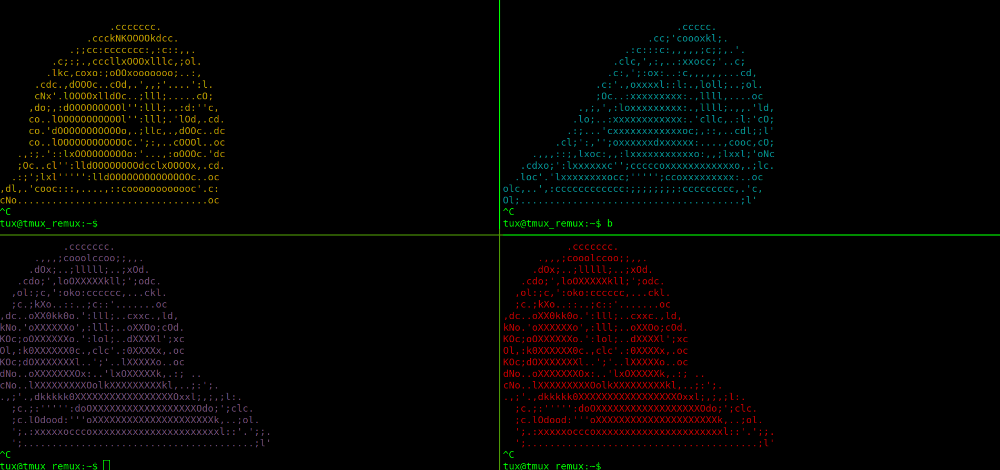

---
search:
    boost: 400 
---

# REmux The Tmux

Updated, how to use tmux guide. Defaults and customize your workflow.

| Difficulty | Time to complete | Number of Tasks | Machine OS | Completed |
| :--------: | :--------------: | :-------------: | :--------: | :-------: |
| Easy       | 30 mins          | 7 Task          | Linux      | <!-- :materi`al-check-all: Completed --> |

## Task 1 - Tmux practice machine

Tmux is known as a terminal multiplexer. That allows you to craft a single terminal however you need it.

Here is a machine you can use to complete the room if you don't have tmux installed on your local machine. Also comes with all the code and plugins needed for future tasks.

Username: tux

Password: tmuxwithremux

### Question 1 

Start the VM if you need it and ssh in.

- [ ] Completed

