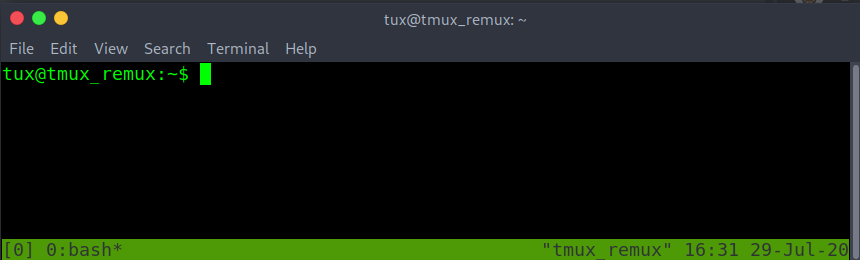

---
search:
    boost: 400 
---

# REmux The Tmux

Updated, how to use tmux guide. Defaults and customize your workflow.

| Difficulty | Time to complete | Number of Tasks | Machine OS | Completed |
| :--------: | :--------------: | :-------------: | :--------: | :-------: |
| Easy       | 30 mins          | 7 Task          | Linux      | <!-- :materi`al-check-all: Completed --> |

## Task 1 - Tmux practice machine

Tmux is known as a terminal multiplexer. That allows you to craft a single terminal however you need it.

Here is a machine you can use to complete the room if you don't have tmux installed on your local machine. Also comes with all the code and plugins needed for future tasks.

Username: tux

Password: tmuxwithremux

### Question 1 

Start the VM if you need it and ssh in.

- [ ] Completed

### Task 2 - Starting tmux "Sessions" and default tmux "prefix"

To start a new tmux session just run the tmux command with no arguments. The first session create will have the name "0". By default, tmux status bar will be green. With session name on the left. Windows in the middle and window names in the middle. Hostname, time, and date on the right of the bottom green bar.

Tmux doesn't allow to create of a nested tmux within a tmux unless you force it to. When running the tmux command a second time.

To change the session name from "0" -> "box-dev". Must first learn how tmux is called. All commands within a tmux session all start with the tmux prefix is. By default, the tmux prefix is "Ctrl b".

After the tmux prefix. To the hotkeys to change the current tmux session's name is "shift $". 

ctrl b shift $

Retype the new name and then enter-key to save the new session name.

If there is a need to create another tmux session within the current one. Use the -d argument with the tmux command. To spawn a new tmux session without attaching to it. In the example image below. The -s argument is used to specify the session name for the new session. Typed as "tmux new -s <new-session-name> -d".

To list all active tmux sessions. Run tmux with list-sessions. Or the short version of list-sessions as ls. In the example below. Running tmux ls also shows the current session in use. Marked by "(attached)".

Exiting a tmux session without closing it can be done with the prefix. Followed by d

ctrl b d

Checking again with the tmux ls command. "(attached)" is missing from both sessions. This means the sessions are active but we are detached and are unable to interact with either session.

To reattach to an active tmux session. Run tmux with the attach option and -t followed by the desired session name.

The tmux session name has changed to the attached session of "tryhackme". Double-checking with tmux ls. Can confirm that "(attached)" also on the "tryhackme" session name.

Delete a single session by its session name. Is done with the kill-session option with tmux. Followed by -t and the <target-session-name-to-delete>

Listing sessions with tmux ls. This shows that the session name of box-dev has been removed. WARNING! By deleting the session. Anything open in that session will be lost if not saved before the tmux kill-session.

In the example below there are many sessions open. Another way to swap sessions without having to detach and reattach to another session. Is to use the prefix. Followed by the s-key to list all open sessions. Using up or down arrow keys to navigate to the desired tmux session. Then enter to select the new session.

ctrl b s

Change from session name "0" to "tmux_remux" without having to leave the current tmux session.

From the five active sessions above. If there was a need to kill all the sessions except for a single one. When using the tmux kill-session. Use the -a argument to close all sessions except the one specified by the -t argument. Closing all tmux sessions except for the one named "is-0day-0k?". Checked with the tmux list-sessions.

When spiting the session into different sized panes ("which will be covered in more detail in a later task"). The new pane will spawn in the directory that the tmux session was first started in. 

To change the base starting directory. Must first learn about tmux prompt or command mode. The tmux prompt allows tmux sessions to run tmux commands without the tmux binary name. Useful when the terminal has been filled with other text. Enter a tmux prompt with prefix shift :

ctrl b shift :

Followed by "attach -c /path/to/new/starting/directory"

With the updated starting or base directory done above as /dev/shm. Creating a new pane start in the /dev/shm directory.

Even though at the start tmux doesn't allow nested tmux within a tmux. Attaching or starting a new tmux session on another computer by an ssh connection. Can make a nested tmux. Not a problem. Just by changing the number of prefix used before the following command. Can determine which session gets the command.

prefix, prefix, and command. This will run on the second nested tmux session of the ssh ubuntu machine.

prefix and command. This will run on the first tmux session. The session running on the current machine's localhost.
