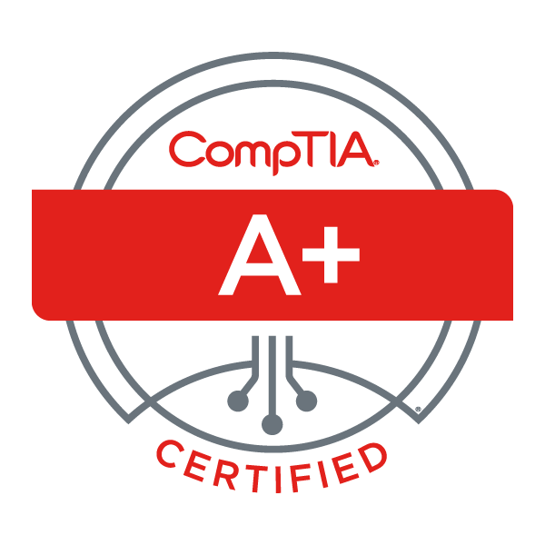

# CompTIA A+ - Overview

CompTIA A+ is the industry standard for launching IT careers into today’s digital world.

{ width="300"}

## Introduction

CompTIA A+ is a globally recognized certification that validates foundational IT skills and knowledge. It serves as a stepping stone for individuals aspiring to launch a career in the vast and dynamic field of information technology. This comprehensive certification encompasses a wide array of topics, ensuring that certified professionals possess the expertise required to excel in various IT roles.

### Core Components of CompTIA A+ Certification

The CompTIA A+ certification consists of two exams: Core 1 and Core 2. Each exam covers distinct domains of IT knowledge and skills.

### **Core 1 Exam**

- Mobile Devices: Understanding the setup, configuration, and troubleshooting of mobile devices.
- Networking: Grasping networking technologies, protocols, and troubleshooting network connectivity issues.
- Hardware: In-depth knowledge of computer hardware components, installation, and troubleshooting.
- Virtualization and Cloud Computing: Basic understanding of virtualization concepts and cloud computing technologies.
- Hardware and Network Troubleshooting: Developing skills to diagnose and resolve hardware and network problems efficiently.

### **Core 2 Exam**

- Operating Systems: Proficiency in installing, configuring, and troubleshooting Windows, macOS, Linux, and mobile operating systems.
- Security: Understanding security best practices, common threats, and preventive measures to safeguard systems and data.
- Software Troubleshooting: Expertise in diagnosing and resolving software issues across different platforms.
- Operational Procedures: Knowledge of IT operational procedures, change management, and best practices for documentation.

### The CompTIA A+ certification consists of two exams:

Core 1 (220-1101): 90 minutes long
Core 2 (220-1102): 90 minutes long

The cost of each exam is £184 and total cost for both exams is £368

### Testimonial video

Below is a video about a success story about a person who, started as a bricklayer and then moved moved over to compTIA A+ and mcuch more.

<iframe allow="fullscreen" allowfullscreen height="100%" src="https://streamable.com/e/c9eh9x?" width="100%" style="border:none; width:100%; height:100%; position:absolute; left:0px; top:0px; overflow:hidden;"></iframe>

### Link to PDF and powerpoint files for easier learning

#### Powerpoint
<iframe src="https://1drv.ms/p/c/f3cc7770a9851527/IQM3et5a1iL4S7BgyMYUG5Y3AQCHPFxpknu77rE4bvgxiws" width="700" height="500" frameborder="0" scrolling="no"></iframe>

#### PDF 

[PDF CompTIA A+](https://1drv.ms/b/c/f3cc7770a9851527/EVAB8WXj01hDml7iRyXZPwgBPubsjehC1wAx0fN-BSnprw?e=wtQOS3)

